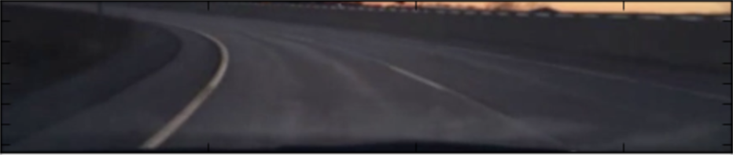
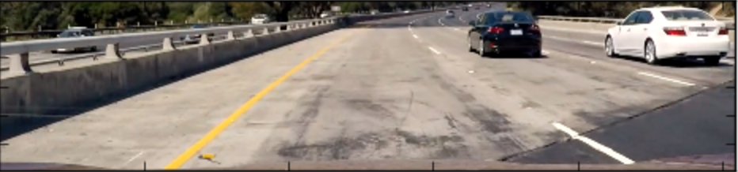
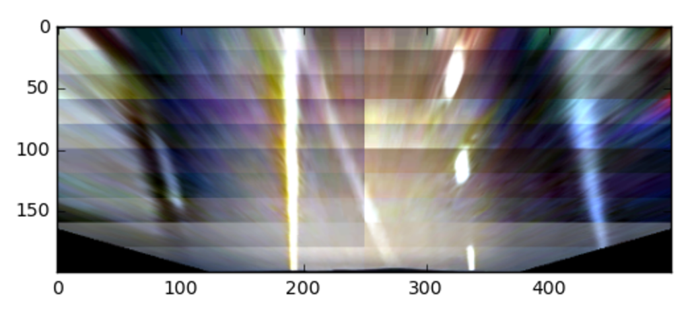
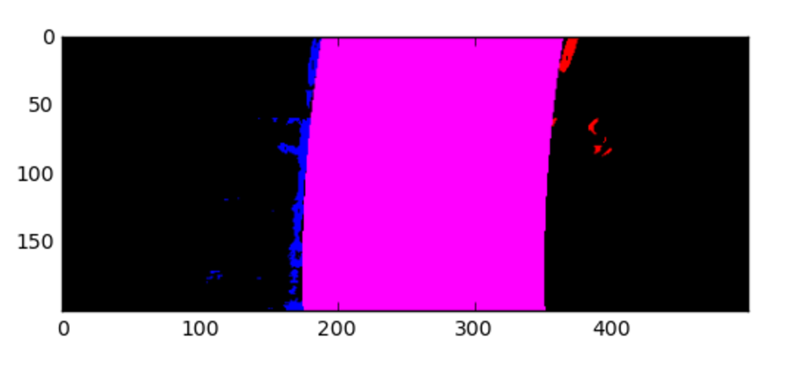

###### Hans B. Gronewold

# FINDING HIGHWAY LANE CURVES
#### A Udacity Self-Driving Car Project
This README will go step-by-step through the image pipeline for roughly detecting traffic lanes on fair-weather Interstates.

** **
  
## Pipeline Output Videos:  
##### Here is a video of my pipeline applied to an _anonymous_ person driving around Appleton, WI ;-)  
  

   
##### The standard project and challenge video output:  
  
  
  
** **

#### The code is all run from Main.py
		  1 # Main.py
		  2 
		  3 #THIS SCRIPT RUNS THE LANE FINDER ON VIDEOS
		  4 from LaneAPI import LaneAPI
		  5 laneFinder = LaneAPI()
		  6 
		  7 
		  8 
		  9 #cropPixels is tuple: ( leftOffset, rightOffset, topOffset, bottomOffset )
		 10 print( 'project_out starting' )
		 11 laneFinder.Calibrate( cropPixels = (0,0,400,30) )
		 12 laneFinder.ProcessVideo( './test_videos/harder_challenge_video.mp4',
		 13                          './out_videos/LANES_harder_challenge_video.mp4' )
		 14 print( 'project_out finished' )
		 15 
		 16 
		 17 
		 18 print( 'project_out starting' )
		 19 laneFinder.Calibrate( cropPixels = (0,0,405,30) )
		 20 laneFinder.ProcessVideo( './test_videos/challenge_video.mp4',
		 21                          './out_videos/LANES_challenge_video.mp4' )
		 22 print( 'project_out finished' )
		 23 
		 24 
		 25 
		 26 print( 'project_out starting' )
		 27 laneFinder.Calibrate( cropPixels = (0,0,381,30) )
		 28 laneFinder.ProcessVideo( './test_videos/project_video.mp4',
		 29                          './out_videos/LANES_project_video.mp4' )
		 30 print( 'project_out finished' )

## Python and Dependencies  
This is put together using Python and a few open libraries, so if you want to play around with it, you will need to find and install them.  
_Also: My apologies for the lack of space/tab standardization in the repo._

		#EXTERNAL DEPENDENCIES    
		import cv2  
		import numpy as np  
		from sklearn import linear_model  
		from sklearn.pipeline import make_pipeline, Pipeline  
		from sklearn.preprocessing import PolynomialFeatures  
		from moviepy.editor import VideoFileClip

** **

## Camera Calibration
You can calibrate a cheap camera/lens using opencv and a standard checkerboard pattern:
[http://docs.opencv.org/2.4/doc/tutorials/calib3d/camera_calibration/camera_calibration.html](http://docs.opencv.org/2.4/doc/tutorials/calib3d/camera_calibration/camera_calibration.html)

##### Here's what's happening
After finding the interior corners, it tries to remove curvature by warping corner locations to a straight grid.   
( I took this through a glass of water for an example ):   
    
Original:  
 
Corners:  
  
Undistorted:  
  

##### A Cleaner Example from the Calibration Images Provided by the Udacity Project:  
Before:  
  

After:  
  

This is done in Calibrate.py:  
 

		 27     def _Calibrate( self, imagesPath, resizeTuple, hCorners, vCorners ):
		 28         #glob get all image file paths matching imagesPath
		 29         images = glob.glob(imagesPath)
		 30 
		 31         #open all images with cv2
		 32         images = tuple(map(lambda x: cv2.imread(x), images))
		 33         if not images:
		 34             return
		 35 
		 36         #if resizing necessary, resize to (w,h) tuple parameter
		 37         if resizeTuple:
		 38             images = tuple(map(lambda x: cv2.resize(x, resizeTuple), images))
		 39 
		 40         #convert image to grayscale
		 41         images = tuple(map(lambda x: cv2.cvtColor(x,cv2.COLOR_BGR2GRAY), images))
		 42 
		 43         #cv2 find chessboard corners
		 44         corners = tuple(map(lambda x: cv2.findChessboardCorners(x,(hCorners,vCorners),None), images))
		 45 
		 46         #filter out unsuccessful calibration images 
		 47         corners = tuple(map(lambda x: x[1], filter(lambda x: x[0], corners)))
		 48         if not corners:
		 49             return
		 50 
		 51         #create objective straight-line ground truth grids for each image
		 52         grid = np.zeros((vCorners * hCorners,3), np.float32)
		 53         grid[:,:2] = np.mgrid[0:hCorners, 0:vCorners].T.reshape(-1,2)
		 54         grids = [grid]*len(corners)
		 55 
		 56         #calibrate the camera
		 57         _, matrix, distortion, _, _ = cv2.calibrateCamera(grids, corners, images[0].shape[:2], None, None)
		 58         self.matrix = matrix
		 59         self.distortion = distortion
		 60 
		 61 
		 62     def Undistort( self, image ):
		 63         #Undistort based on prior calibration
		 64         if self.matrix is not None and self.distortion is not None:
		 65             image = cv2.undistort(image,
		 66                         self.matrix, self.distortion, None, self.matrix)
		 67 
		 68         #Crop pipeline images to area of interest
		 69         if self.cropPixels: #cropPixels is tuple: ( leftOffset, rightOffset, topOffset, bottomOffset )
		 70             cp = self.cropPixels
		 71             image = image[cp[2]:image.shape[0]-cp[3],cp[0]:image.shape[1]-cp[1],:].copy()
		 72 
		 73         return image

** ** 
  
## Cropping
I crop the incoming images during the calibration using a custom set of crop amounts per video as seen in Main.py and Calibration.py above, I crop it to the target region of the image containing the road:   
  
  
   
   
  
  
**  **  
  
  
## Birds-Eye Transformation
I then take the cropped images and transform them to a birds-eye perspective:
   
   
   
   
   

This is done in Transforms.py:  

		  1 # Transforms.py
		  2 
		  3 #EXTERNAL DEPENDENCIES
		  4 import numpy as np
		  5 import cv2
		  6 
		  7 class Transforms:
		  8 
		  9     def __init__( self ):
		 10         self.matrix = None
		 11         self.inverse = None
		 12 
		 13 
		 14     #Setup coordinates to for birdsEye perspective transformations
		 15     #Calculate matrix and inverse matrix based on image size
		 16     def _Setup( self, image ):
		 17         self.oshape0 = int(image.shape[0])
		 18         self.oshape1 = int(image.shape[1])
		 19         #the begin array has the region we are targeting
		 20         #this region will be stretched to create the birds eye view
		 21         begin = np.array([
		 22                     [image.shape[1]*-.5,image.shape[0]*.999],
		 23                     [image.shape[1]*.35,image.shape[0]*.26],
		 24                     [image.shape[1]*.65,image.shape[0]*.26],
		 25                     [image.shape[1]*1.5,image.shape[0]*.999]], dtype=np.float32)
		 26         # This transform area was used for the Appleton video's shorter lane finder
		 27         #            [image.shape[1]*-.3,image.shape[0]*.999],
		 28         #            [image.shape[1]*.25,image.shape[0]*.4],
		 29         #            [image.shape[1]*.75,image.shape[0]*.4],
		 30         #            [image.shape[1]*1.3,image.shape[0]*.999]], dtype=np.float32)
		 31 
		 32         #the end array has the image corners
		 33         end = np.array([
		 34                     [0,image.shape[0]],
		 35                     [0,0],
		 36                     [image.shape[1],0],
		 37                     [image.shape[1],image.shape[0]]], dtype=np.float32)
		 38 
		 39         #save the transformation parameters 
		 40         self.matrix = cv2.getPerspectiveTransform( begin, end )
		 41         self.inverse = cv2.getPerspectiveTransform( end, begin )
		 42 
		 43 
		 44     #Warp to birds-eye view perspective
		 45     def BirdsEye( self, image ):
		 46         if self.matrix is None: #This is the first pipeline step
		 47             self._Setup( image ) #Setup based on Size of image
		 48 
		 49         im =  cv2.warpPerspective( image, self.matrix, \
		 50                                     image.shape[::-1][1:], \
		 51                                     flags=cv2.INTER_LINEAR)
		 52         im = cv2.resize(im, (500,200))
		 53         return im
		 54 
		 55 
		 56     #Reverse the birds-eye perspective transform back to normal
		 57     def HumanEye( self, image ):
		 58         image = cv2.resize(image, (self.oshape1, self.oshape0))
		 59         im = cv2.warpPerspective( image, self.inverse, \
		 60                                     image.shape[::-1][1:], \
		 61                                     flags=cv2.INTER_LINEAR)
		 62         return im
		 63 

## Color Pre-Processing
I then process the image in several different rectangles, and for each rectangle, I clip out everything 2 standard deviations from the mean and stretch the remaining values back to 0-255 range.  This helps brighten the lane lines saturation values, especially on darker images. 
 
   
   
   
  
This also happens in Transforms.py:

		 65     #Standardize color to enhance lane line contrast in image
		 66     def Standardize( self, image ):
		 67         #Get incoming image shape
		 68         osizey,osizex,osizez = image.shape
		 69 
		 70         #breakup into rectangles, each will be standardized seperately
		 71         boxesizey = 20
		 72         boxedy = image.shape[0] // boxesizey
		 73         for i in range(boxedy):
		 74             for xsplit in range(2):
		 75                 #breakup into rectangle based on loop indexes
		 76                 sxs = (osizex >> 1)
		 77                 sx = xsplit * sxs
		 78                 sx2 = (xsplit + 1)  * sxs
		 79                 img = image[i*boxesizey:(i+1)*boxesizey, sx:sx2, :]
		 80 
		 81                 #Find 2 standard deviations from the mean value in region
		 82                 x = img.copy().reshape(-1,3).astype(np.float32)
		 83                 stdx = 2.0 * np.std(x, axis=0)
		 84                 avgx = np.mean(x, axis=0)
		 85 
		 86                 #Clip original image to 2 stdeviations from mean
		 87                 x = np.clip(img.reshape(-1,3), avgx-stdx, avgx+stdx)
		 88 
		 89                 #Scale values back to 0-255
		 90                 x = x - np.min(x, axis=0)
		 91                 x = x.astype(np.float64) / (np.max(x, axis=0) + 0.00000001)
		 92                 x = np.clip((x*255.0).astype(np.uint8), 0, 255)
		 93 
		 94                 #update standardized image region
		 95                 image[i*boxesizey:(i+1)*boxesizey, sx:sx2, :] = x.reshape((boxesizey,sxs,3))
		 96 
		 97         return image
		                                         
  
** **  
  
    
## Value Filter, Red Filter, and Sobel X-Gradients
I only keep values that meet certain (HSV) V-value levels and (RGB) red levels, then I use horizontal Sobel Edge detection on the Blue channel (blurring the results to keep more than just thin edge detected lines).  
  
   
    

This is done in Masking.py:  

		  1 # Masking.py
		  2 
		  3 #EXTERNAL DEPENDENCIES
		  4 import numpy as np
		  5 import cv2
		  6 
		  7 class Masking:
		  8 
		  9     def LaneEdges( self, image ):
		 10         #Mask image based on red channel
		 11         r_binary = self._RedMask( image )
		 12 
		 13         #Mask image based on value channel
		 14         v_binary = self._ValueMask( image )
		 15 
		 16         #Mask image based on Sobel Edges over the blue channel
		 17         sb_binary = self._SobelBlueMask( image )
		 18 
		 19         #Aggregate masks to single masking
		 20         mask = self._FullMask( r_binary, sb_binary, v_binary )
		 21 
		 22         #Crop out data outside possible lane curvatures
		 23         mask = self._CropMask( mask )
		 24 
		 25         return mask
		 26 
		 27 
		 28     def _RedMask( self, image ):
		 29         #pull red channel from RGB image
		 30         r_channel = image[:,:,0]
		 31 
		 32         #mask channel based on threshold 245-255
		 33         r_binary = np.zeros_like(r_channel)
		 34         r_binary[ (r_channel >= 235) ] = 1
		 35 
		 36         return r_binary
		 37 
		 38 
		 39     def _ValueMask( self, image ):
		 40         #pull value channel from RGB image
		 41         hsv = cv2.cvtColor(image, cv2.COLOR_RGB2HSV)
		 42         v_channel = hsv[:,:,2]
		 43 
		 44         #mask channel based on threshold 245-255
		 45         v_binary = np.zeros_like(v_channel)
		 46         v_binary[ (v_channel >= 245) ] = 1
		 47 
		 48         return v_binary
		 49 
		 50 
		 51     def _SobelBlueMask( self, image ):
		 52         #pull blue channel from RGB image
		 53         b_channel = image[:,:,2]
		 54 
		 55         #resize image to 600x600 and make Vertical Sobel Edges
		 56         x = cv2.resize( b_channel, (600,600) )
		 57         x = np.absolute( cv2.Sobel(x, cv2.CV_64F, 1, 0, ksize=31) )
		 58         x = np.uint8( 255 * x / (np.max(x) + 0.00000001) )
		 59 
		 60         #blur sobel edges to give more information to curve regression
		 61         x = cv2.resize(x, (300,300))
		 62         x = cv2.resize(x, (image.shape[1], image.shape[0]))
		 63 
		 64         s_binary = np.zeros_like(b_channel)
		 65         s_binary[ (x >= 25)  ] = 1
		 66 
		 67         return s_binary
		 68 
		 69 
		 70     def _FullMask( self, maskA, maskB, maskC ):
		 71         mask = np.zeros_like(maskA)
		 72         mask[  (maskA == 1) & (maskB == 1) & (maskC == 1) ] = 255
		 73         return mask

		                                         
  
** **  
  
    
## Static Masking
I then crop out certain static areas of the images where the road shouldn't be, like the bottom corners
  
  

This is also done in Masking.py:  
		
		 76     def _CropMask( self, image ):
		 77         #crop out lower left and lower right corners, assuming car is not riding ontop of a lane
		 78         keep_region = np.array( [
		 79                 [ image.shape[1]*.2,    image.shape[0]*.999 ],
		 80                 [ image.shape[1]*.22,    image.shape[0]*.55 ],
		 81                 [ image.shape[1]*.15,    image.shape[0]*.001 ],
		 82                 [ image.shape[1]*.85,    image.shape[0]*.001 ],
		 83                 [ image.shape[1]*.78,    image.shape[0]*.55 ],
		 84                 [ image.shape[1]*.8,    image.shape[0]*.999 ] ], dtype=np.int)
		 85         keep_area = np.zeros_like( image )
		 86         cv2.fillPoly( keep_area, [keep_region], 255 )
		 87         result = cv2.bitwise_and( image, keep_area )
		 88 
		 89         #Crop out very bottom center, assuming car is not riding ontop of a lane line   
		 90         halfw = int(result.shape[1] // 2)
		 91         halfh = int(result.shape[0] // 2)
		 92         halfd = int(result.shape[1] // 16)
		 93         result[ halfh:, halfw-halfd:halfw+halfd ] = 0
		 94         return result
		 95 

** **  

## I then split the picture into left and right channels

    

Masking.py:  

		 97     def _SplitLanes( self, mask ):
		 98         #remove 3rd array dimension ( its size one anyway )
		 99         mask = mask.reshape(mask.shape[:2])
		100 
		101         #divide image in half horizontally
		102         w_ = mask.shape[1] // 2
		103 
		104         #empty right half of left lane mask
		105         left_mask = mask.copy()
		106         left_mask[:,w_:] = left_mask[:,w_:] * 0
		107 
		108         #empty left half of right lane mask
		109         right_mask = mask.copy()
		110         right_mask[:,:w_] = right_mask[:,:w_] * 0
		111 
		112         #Return new R,G,B mask - R = Left Lane, G = Empty, B = Right Lane
		113         empty_mask = np.zeros(mask.shape)
		114         return np.dstack( ( left_mask*255, empty_mask, right_mask*255 ) )
	
  
## More Dynamic Masking to Remove Outliers
I then remove the center of the lane and very center of the image using prior known curve regression:

Regress.py

		 30         # if we already have a curve context 
		 31         # remove mask noise from central area inside the lane lines according to known curve
		 32         if self.lastModel is not None and self.lastCount < 40:
		 33             d = int(self.avgDistance) >> 2
		 34             curve_model = self.lastModel
		 35             for y in range(splitMask.shape[0]):
		 36                 split = curve_model.predict(np.array([y]).reshape(-1,1))
		 37                 splitMask[y,split-d:split+1, 0] = 0
		 38                 splitMask[y,split-1:split+d, 2] = 0
		 39 
		 40         #ignore center line vertical striping from color standardization
		 41         halfw = int(splitMask.shape[1]//2)
		 42         splitMask[:,halfw-3:halfw+3,:] = 0
		 43 
 
 	                                                                                   
  
** **   

## I Find the Average Lane Position (X) for each Row (Y)

  
Using a Histogram to locate each lane wasn't working well because the noise in each row was enough to make the histogram choose the noise over the lane position, and often had higher values than the lane edges, so I switched to a new approach using averaging instead...

Histogram Example:  
    

Here is what the result of my approach looks like visually:  
   

And this is what's happening:  

I multiply X-Coordinates (columns) against a boolean matrix of the mask and then average by row to find average X-Coordinate  per Y-Coordinate (row):  

Regress.py:

		 44		    #change to 0-1 value range
		 45         binMask = np.clip(splitMask.copy(), 0, 1).astype(np.float32)
		 46 
		 47         #build 3d array filled with x-position location
		 48         xValues = list(range( splitMask.shape[1] ))
		 49         x3d = np.dstack((xValues,xValues,xValues)).astype(np.float32)
		 50 
		 51         #multiply mask by x-positions to replace ON values with x-positions
		 52         xfactor = binMask * x3d
		 53 
		 54         #get average x-position for every y row
		 55         with np.errstate(invalid='ignore', divide='ignore'):
		 56             averageXposition = np.true_divide( \
		 57                 xfactor.sum(axis=1), (xfactor>0).sum(axis=1) )
		 58         averageXposition = np.clip( averageXposition, 0, splitMask.shape[1] - 1 )
		 59         averageXposition = averageXposition.astype(np.int)
		 60 
		 61         #each  y value now holds average x coordinate of the lane lines in that dimension
		 62         return averageXposition

Then I calculate the average center of the lane based on the average left and average right lane values per row:
  
Regress.py:  

		 65     def _GetAverageDistanceFromLaneToCenter( self, averageXposition, width ):
		 66         avg_dist = 0
		 67         avg_count = 0
		 68         #avg_dist is half the average distance between the lanes in pixels
		 69         #given the average x positions in the two lane dimensions (0,1) calculate average pixel distance
		 70         for x in averageXposition:
		 71             if (x[2] > 1 and x[0] > 1):
		 72                 avg_count += 1
		 73                 avg_dist += x[2]-x[0]
		 74         if avg_count > 0 and avg_dist > 0:
		 75             avg_dist = int(abs(avg_dist / avg_count) // 2)
		 76         else:
		 77             avg_dist = int(width // 6)
		 78 
		 79         #smooth out the new calculation based on previous frame distance calculations
		 80         newavg = int(avg_dist)<<1
		 81         if (newavg > 50):
		 82             self.avgDistance = (self.avgDistance*0.95 + newavg*0.05)
		 83             avg_dist = int(self.avgDistance // 2)
		 84 
		 85         #calculate center lane position based on the left/right lanes and distance
		 86         centers = np.zeros(averageXposition.shape[:1], dtype=np.int)
		 87         for y in range(len(averageXposition)):
		 88             x = averageXposition[y]
		 89             if ( x[0] > 1 and x[2] > 1 ):
		 90                 centers[y] = int( (x[0] + x[2]) >> 1 )
		 91             elif ( x[0] > 1 ):
		 92                 centers[y] = int( x[0] + avg_dist )
		 93             elif ( x[2] > 1 ):
		 94                 centers[y] = int( x[2] - avg_dist )
		 95 
		 96         return centers
		 
		 
** **  

   
## Shift Left and Right Lane Masks Into Center For Improved Regression
Next I take these centers and average lane distance, and use that to shift the left and right lane masks into the center of the lane in a single binary mask so that I have better data to regress a curve over:

Here's what the new masks look like after this step:
    
   
 
 

This is done in Regress.py:  

		
		 98     def _ShiftSplitMaskIntoCenter( self, splitMask, centers ):
		 99         #based on the the distance and centers shift the left right masks into the center 
		100         distance = int(self.avgDistance) >> 1
		101         right = np.roll(splitMask[:,:,2].copy(), -distance, axis=1).astype(np.bool)
		102         left = np.roll(splitMask[:,:,0].copy(), distance, axis=1).astype(np.bool)
		103         middle = np.zeros((splitMask.shape[0], splitMask.shape[1])).astype(np.bool)
		104         #add current context bias to the mask by plotting points on our current curve into the mask
		105         for y,x in enumerate(centers):
		106             if (x > 1):
		107                 x = max(5,min(splitMask.shape[1]-6,x))
		108                 middle[y,x-5:x+5] = True
		109         #combine left, right, and current curve into one binary mask 
		110         full = (left | middle | right )
		111         return full

** **  

   
## Regress Polynomial Curve with Ransac to Heavily Ignore Outliers 
After Regressing the Curve, I paint the values at the center over the distance of the lane calculated earlier:

    
    
  

This step also keeps binary lane mask data from prior frames to fit a smoother curve.  
The regression maps Y value (row) to predict X value (column) for the curve.  
All of this code happens in Regress.py as well, which still needs to be refactored:

		113     def _FitCurve( self, splitMask, centerShifted ):
		114         #keep some mask information from prior frames
		115         tenFrame = len(centerShifted) * 100
		116         if len(self.lastX) > tenFrame:
		117             self.lastX = self.lastX[-tenFrame:]
		118             self.lastY = self.lastY[-tenFrame:]
		119 
		120         #append current mask information to lastX and lastY lists 
		121         for y,row in enumerate(centerShifted):
		122             for x,v in enumerate(row):
		123                 if v:
		124                     self.lastX.append(x)
		125                     self.lastY.append(y)
		126 
		127         #regress a polynomial fit to lastX,lastY information
		128         try:
		129             model_ransac = Pipeline(steps=[('kernel',PolynomialFeatures(2)), \
		130                      ('ransac',linear_model.RANSACRegressor(linear_model.LinearRegression()))])
		131             model_ransac.fit(np.array(self.lastY).reshape(-1,1),  \   
		131									np.array(self.lastX).reshape(-1,1))
		132             self.lastModel = model_ransac
		133             self.lastCount = 0
		134         except Exception as e:
		135             #if		 the polynomail fit fails, use the last model and 
		135										increment the count of misses (lastCount)
		136             print(str(e))
		137             if self.lastModel is not None and self.lastCount < 40:
		138                 model_ransac = self.lastModel
		139                 self.lastCount += 1
		140             else:
		141                 #if there's no lastModel or we missed too many times, 
		141										return lines mask as overlay, don't plot a lane
		142                 return (splitMask.astype(np.int) * 255).astype(np.uint8)
		143 
		144         #using the regression, paint the lane onto the image
		145         imagenew = splitMask.copy().astype(np.int)
		146         distance = int(self.avgDistance / 2 * 0.999)
		147         for y in range(splitMask.shape[0]):
		148             x = model_ransac.predict(np.array([y]).reshape(-1,1))
		149             x = max(min(splitMask.shape[1]-1, x) , 0)
		150             imagenew[y,0:int(x)-int(distance*1.5),2] = 0
		151             imagenew[y,int(x)+int(distance*1.5):,0] = 0
		152             imagenew[y,int(x)-distance:int(x)+distance,0] = 1
		153             imagenew[y,int(x)-distance:int(x)+distance,2] = 1
		154 
		155         imagenew = (imagenew * 255).astype(np.uint8)
		156         return imagenew
		157 
		
** **

  
## Reverse Perspective Transform
I then transform this overlay back to original perspective in the Transforms.py HumanEye function, and overlay the mask onto the original image in the Pipline.py Overlay function.  (These test images also show my center lane mask data per frame as the thin green line pieces, but this is not done in the repo code. )

    
    
  

** **  

## Calculate Curvature Radius and Distance from Camera Center
I also calculate the radius of curvature based on the regressed curve, and distance from center in regress.py:  

		
		209         #Calculate the Center Offset and Radius of Curvature
		210         y3 = splitMask.shape[0]
		211         x3 = self.lastModel.predict(np.array(y3).reshape(-1,1))[0][0]
		212 
		213         offCenter = splitMask.shape[1]//2 - x3  #distance from center scrn
		214         offCenter = offCenter / self.avgDistance #screen pixels/lane width 
		215         offCenter = offCenter * 370 #distance in CM of USA lane width
		216         self.offsets.append(offCenter)
		217         if len(self.offsets) > 30:
		218                 self.offsets = self.offsets[1:]
		219 
		220 
		221         #get the coefficients of the curve      
		222         A = self.lastModel.named_steps['ransac'].estimator_.coef_[0][1]
		223         B = self.lastModel.named_steps['ransac'].estimator_.coef_[0][2]
		224         #calculate radius of curvature from polynomial coefficients
		225         radius = ((1+(2*y3+B)**2)**1.5)/abs(2*A)
		226         radius = radius / self.avgDistance
		227         radius = radius * 3.7
		228         radius = radius / 1000000
		229 
		230         #appned to list of curves used for averaging    
		231         self.curves.append(radius)
		232         if len(self.curves) > 30:
		233                 self.curves = self.curves[1:]
		234 
		235         #do the averaging and return the results
		236         curvature = np.mean(self.curves)
		237         offset = np.mean(self.offsets)
		238         return ( curvature, offset, curveFitted )
  
** ** 

  
## THAT'S ALL FOLKS:  

And again, a link to the main project video output after all of this is completed:
  

** ** 

  
## Discussion of Limitations:  
  
  
There are several factors which cause this pipeline to break:  
1. Saturation/Red overload - Things like blinding light, snow, and bird poop may make the lanes unfindable with the color masking.  
2. Uphill/Downhill/Camera Angle - These will break the perspective transform to bird's eye view which is currently hardcoded.  
3. Tighter Off-Highway Corners - Again, this will break some static masking and perspective transform pieces.  
4. The Unkown - This is not a safe pipeline, please don't use this in your self-driving car project!  

Here is an example of almost all of the above limitations with the Harder Challenge Video where the entire pipeline continues to fail:  

  

  
  
** ** 
  
_This is The End :-)_
  
  
** **  

  
